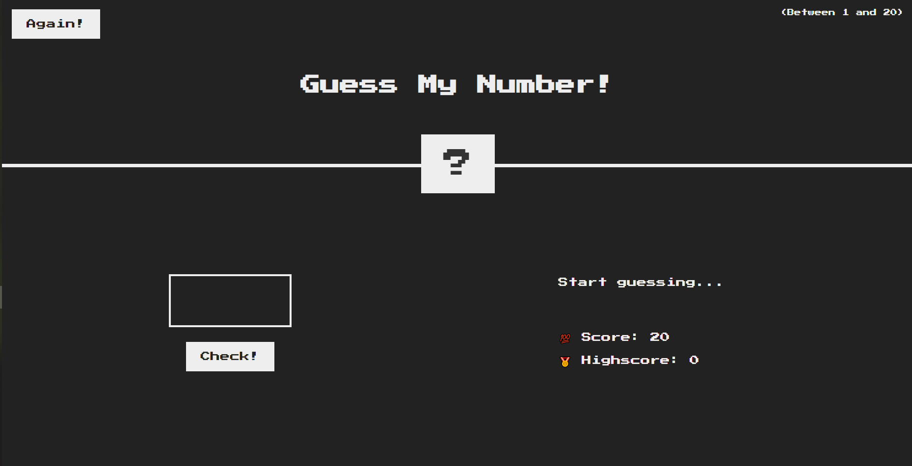

# Project View 

# Project Description 😪

---

This game is basically I build for my practice. I copied idea from jonas Schmedtmann. He is a instructor of Udemy. So This projects was included ( The Complete JavaScript Course 2021: From Zero to Expert! ) . Dom Based Project

# Game Description 🎲

---

This is a  Solo player Game. So you have to guess a number by fill check input. if your guess correct then you will get points .  you have to guess between  number  in **( 1-20 ) .**   You will get Score 20 and everytime of you guess , your current Score will be deducated by 1 . when your score will less then 1 your game will be finished. By example if you gues 5 times then your current score will be 15 and if you get correct guess on 5th time then your score and highscore for current will be 15. 

After you win or loose you can play again.  in win case your Highscore will not be reset but if you loose your higscore will be reset . 

# Technology Used 🛠

---

- Html
- Css
- javaScript

# How to play ? 😴

- Guess a Number and fill check input and click it
- if you win or loose you have to click again button
